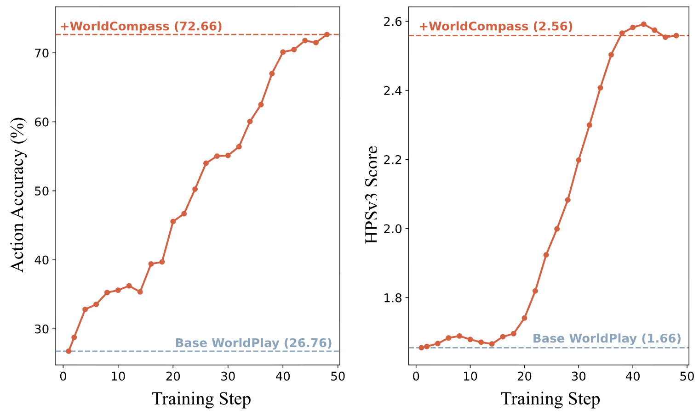
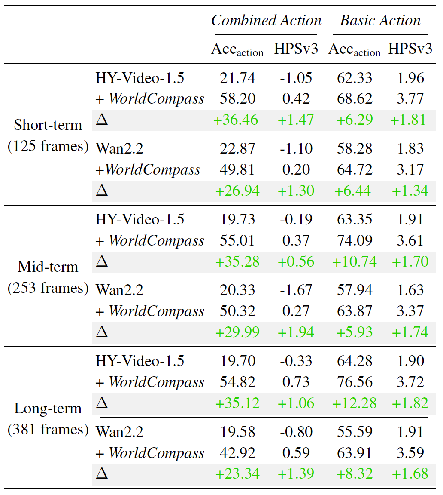

## Introduction to WorldCompass

WorldCompass uses Group Relative Policy Optimization (GRPO) idea to improve
action-following and visual quality in autoregressive video generation.

## Training Guidence

The training pipeline includes:

1. **Environment Setup** - Install dependencies
2. **Model Download** - Download pretrained checkpoints
3. **Dataset Preparation** - Prepare image-text latents and action trajectories
4. **Training** - Run reinforcement learning training

---

### Step 1: Environment Setup

---

**1.1 Create Conda Environment**

```bash
# Create and activate environment
conda create -n worldcompass python=3.10 -y
conda activate worldcompass

# Install dependencies
pip install -r requirements.txt
pip install transformers==4.50.0

# Install Flash Attention (recommended for faster training)
pip install flash-attn==2.7.3 --no-build-isolation
```

---

### Step 2: Model Preparation

---

**2.1 Download Model Checkpoints**

```bash
# Download all required models
python download_models_worldcompass.py --hf_token <your_huggingface_token> --cache_dir <your_cache_dir>
```

**Note**: You need access to FLUX.1-Redux-dev for the vision encoder:

1. Request access: https://huggingface.co/black-forest-labs/FLUX.1-Redux-dev
2. Create token: https://huggingface.co/settings/tokens (select "Read"
   permission)

The script will download:

- **HunyuanVideo-1.5** base model (VAE, scheduler, 480p transformer)
- **HY-WorldPlay** action models (AR model, bidirectional model, distilled
  model)
- **Qwen2.5-VL-7B-Instruct** text encoder
- **ByT5** encoders (byt5-small + Glyph-SDXL-v2)
- **SigLIP** vision encoder (from FLUX.1-Redux-dev)
- **DepthAnythingV3** camera pose estimation model - Option 1
- **Hunyuan-WorldMirror** camera pose estimation model - Option 2

---

**2.2 Clone DepthAnythingV3 Repository**

```bash
git clone https://github.com/ByteDance-Seed/Depth-Anything-3.git DepthAnythingV3
mv ./DepthAnythingV3/src/depth_anything_3 ./depth_anything_3
```

---

### Step 3: Dataset Preparation

---

**3.1 Prepare Input Data**

Create a JSON file containing your training data:

```json
[
  {
    "image_path": "/path/to/image1.jpg",
    "caption": "A serene park with trees and a bridge over water"
  },
  {
    "image_path": "/path/to/image2.png",
    "caption": "A modern city street at sunset"
  }
]
```

---

**3.2 Extract Image-Text Latents**

This step encodes images and text into latent features using VAE and text
encoders.

**Single GPU**:

```bash
python prepare_dataset/prepare_image_text_latent_simple.py \
    --input_json /path/to/train.json \
    --output_dir /path/to/train_latents \
    --hunyuan_checkpoint_path /path/to/hunyuanvideo_1_5
```

**Multi-GPU (Recommended)**:

```bash
torchrun --nproc_per_node=8 prepare_dataset/prepare_image_text_latent_simple.py \
    --input_json /path/to/train.json \
    --output_dir /path/to/train_latents \
    --hunyuan_checkpoint_path /path/to/hunyuanvideo_1_5
```

**Output Structure**:

```
/path/to/train_latents/
├── latents/
│   ├── 0_000000.pt
│   ├── 0_000001.pt
│   └── ...
└── latents.json          # Index file for training
```

Each `.pt` file contains:

- `latent`: VAE-encoded image features [1, C, T, H, W]
- `image_cond`: First frame condition [1, C, 1, H, W]
- `prompt_embeds`: Text embeddings [1, L, D]
- `prompt_mask`: Text attention mask [1, L]
- `vision_states`: Visual features [1, N, D]
- `byt5_text_states`: ByT5 text features [1, 256, 1472]
- `byt5_text_mask`: ByT5 attention mask [1, 256]

---

**3.3 Prepare Evaluation Data**

To support observing model performance on a fixed subset during training, we
recommend building a mini evaluation dataset. The JSON file format is the same
as the training data. The recommended number should be divisible by the expected
number of GPUs, and for efficiency, typically 16 or 32 samples are sufficient.

```bash
python prepare_dataset/prepare_image_text_latent_simple.py \
    --input_json /path/to/eval.json \
    --output_dir /path/to/eval_latents \
    --hunyuan_checkpoint_path /path/to/hunyuanvideo_1_5
```

---

**3.4 Generate Action Trajectories**

Generate random camera trajectory sequences for training:

```bash
python prepare_dataset/prepare_custom_action.py
```

**Default Output**: `prepare_dataset/harder_random_poses.json` (1000
trajectories, 128 actions each, default settings favor generating complex
composite actions)

**Customize**: Edit `prepare_custom_action.py` to adjust number of trajectories
and actions per trajectory, as well as trajectory template synthesis rules.

---

### Step 4: Start Training

---

**4.1 Configure Training Script**

Modify the TODO configs in `scripts/train_worldcompass.sh`:

```bash

export MASTER_ADDR=""       # [TODO] Set master address

# NOTE: Run download_models.py (Step 2) can get the exact paths for the variables below.
CACHE_DIR=""              # [TODO] Fill in the overall checkpoint cache directory (as printed by download_models.py)
HUNYUAN_CHECKPOINT=""     # [TODO] Fill in the HunYuan checkpoint directory
WORLDPLAY_CHECKPOINT=""   # [TODO] Fill in the WorldPlay checkpoint directory

TRAIN_LATENTS_DIR=""      # [TODO] Path to the train latents directory
EVAL_LATENTS_DIR=""       # [TODO] Path to the eval latents directory
POSE_PATH=""              # [TODO] Path to the custom action pose json
OUTPUT_DIR=""             # [TODO] Path to the output directory

--wandb_key ""            # [TODO] Set wandb key
--wandb_entity ""         # [TODO] Set wandb entity
```

---

**4.2 Training!!!**

Training on 8 GPUs can show initial improvements, but more nodes typically
result in more stable training and better final results.

**Single Node (8 GPUs)**:

```bash
bash scripts/train_worldcompass.sh 0 1
```

**Multi-Node Training**:

```bash
# On each node, run with appropriate rank
# Node 0 (master):
bash scripts/train_worldcompass.sh 0 4  # 4 nodes total

# Node 1:
bash scripts/train_worldcompass.sh 1 4

# Node 2:
bash scripts/train_worldcompass.sh 2 4

# Node 3:
bash scripts/train_worldcompass.sh 3 4
```

**Note**: Ensure all nodes can communicate via `MASTER_ADDR` and `MASTER_PORT`.

**4.3 Monitor Training**

Training logs and checkpoints will be saved to:

```
${CKPT_DIR}/${exp_name}/
├── checkpoint-{step}/
│   ├── transformer/
│   │   └── diffusion_pytorch_model.safetensors
│   └── training_state.pt
└── generated_videos/           # Sample videos during training
```

If WandB is configured, metrics will be logged to your WandB dashboard.

### 4.4 Hardware Requirements

Our experiments were conducted on GPUs with 96GB memory. If you encounter GPU
OOM issues, consider:

- Reducing `window_frames`
- Converting VAE to `torch.bf16` (may cause training instability)

## Results

We have conducted comprehensive validation on the **WorldPlay** baseline model. Our evaluation demonstrates that after undergoing **WorldCompass** post-training, the model's capabilities undergo a qualitative leap, particularly in both interaction following and visual quality.


<p align="center">
  
</p>
<p align="center">
  
</p>


## 📚 Citation

```bibtex
@article{hyworld2025,
  title={HY-World 1.5: A Systematic Framework for Interactive World Modeling with Real-Time Latency and Geometric Consistency},
  author={Team HunyuanWorld},
  journal={arXiv preprint},
  year={2025}
}

@article{wang2026worldcompass,
  title={WorldCompass: Reinforcement Learning for Long-Horizon World Models},
  author={Wang, Zehan and Wang, Tengfei and Zhang, Haiyu and Zuo, Xuhui and Wu, Junta and Wang, Haoyuan and Sun, Wenqiang and Wang, Zhenwei and Cao, Chenjie and Zhao, Hengshuang and others},
  journal={arXiv preprint},
  year={2026}
}

@article{worldplay2025,
    title={WorldPlay: Towards Long-Term Geometric Consistency for Real-Time Interactive World Model},
    author={Wenqiang Sun and Haiyu Zhang and Haoyuan Wang and Junta Wu and Zehan Wang and Zhenwei Wang and Yunhong Wang and Jun Zhang and Tengfei Wang and Chunchao Guo},
    year={2025},
    journal={arXiv preprint}
}
```

## Contact

Please send emails to tengfeiwang12@gmail.com if there is any question

## 🙏 Acknowledgements

We would like to thank
[HunyuanWorld](https://github.com/Tencent-Hunyuan/HunyuanWorld-1.0),
[HunyuanWorld-Mirror](https://github.com/Tencent-Hunyuan/HunyuanWorld-Mirror),
[HunyuanVideo](https://github.com/Tencent-Hunyuan/HunyuanVideo-1.5),
[DiffusionNFT](https://github.com/NVlabs/DiffusionNFT) and
[FastVideo](https://github.com/hao-ai-lab/FastVideo) for their great work.
